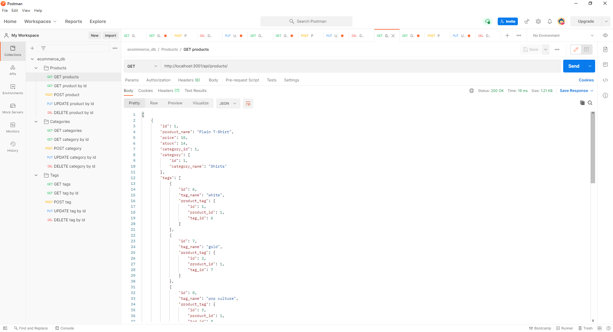

# Ebuy
 

## Description 📝 
---
an ecommerce backend using express and sequelize 📝

## Table of Contents  
---
- [Installation Instructions ⌨️](#installation--)
- [Usage 🖥️](#usage--)
- [Screenshot & Video 📸](#screenshot--video--click-on-screenshot-to-see-video)
- [Contributors 📜](#contributors-)
- [Contact 📠](#contact-)
- [License 📋](#license-)

## Installation ⌨️ 
---
Clone the repo to your machine and create a .env file in the main folder. In it, write 

 DB_USER=' '

 DB_PW=' '

 DB_NAME='ecommerce_db'

and be sure to write in your own relevant username and password (if you are changing the database name to fit a different naming convention, you will have to change it everywhere else it appears in the code). Then, copy-paste the information in the schema.sql file into an app like MySQL Workbench to create the database. In the console, while in the main folder, run npm i -y to install the dependencies. If you already have information to plug in, you can either do so via MySQL (using the outlines in the models files for your tables) or you can change the information in the seeds files. If you do not have information of your own, but want some to play with, type npm run seed into the console, and the database will be seeded with test data. Now, type npm start into the console, and the app will begin.⌨️
  
## Usage 🖥️ 
---
As this is strictly a backend, its usage is primarily through Postman or Insomnia Core. Through these, and using the code as a guide, a user can view, update, add to, or delete from the database using GET, PUT, POST, and DELETE respectively 🖥️
  
## Contributors 📜 
---
Rudie G (sole author) 📜
  
## Screenshot & Video 📸 click on screenshot to see video
---

 
 

## Contact 📠 
---
 
GitHub: https://github.com/rudie-g
 
 
Email: rauoldm@gmail.com
 
 

## License 📋

---
 
This application is covered by <a href=""> no</a> license.
